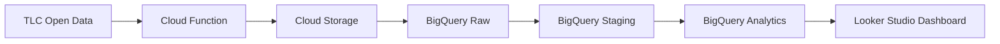

# GCP NYC Taxi Data Engineering Project

End-to-end data engineering pipeline built on Google Cloud Platform using NYC Taxi public datasets.

## Architecture



## Tech Stack

- Google Cloud Platform
- BigQuery
- Cloud Storage
- Cloud Functions
- Cloud Scheduler
- Python
- SQL
- dbt
- Apache Airflow

## Project Structure

```
gcp-nyc-taxi-de/
│
├── pipelines/     # Data ingestion scripts
├── sql/           # SQL transformations
├── dbt/           # dbt models
├── airflow/       # Airflow DAGs
├── terraform/     # Infrastructure as Code
├── docs/          # Documentation
└── README.md
```

## Dataset

Public dataset used:

`bigquery-public-data.new_york_taxi_trips`

Contains millions of NYC taxi trip records.

## Sample Query

```sql
SELECT
EXTRACT(YEAR FROM pickup_datetime) AS year,
COUNT(*) AS trips
FROM `bigquery-public-data.new_york_taxi_trips.tlc_yellow_trips_*`
WHERE _TABLE_SUFFIX BETWEEN "2019" AND "2022"
GROUP BY year
ORDER BY year;
```

## Results

| Year | Trips |
|-----|------|
| 2019 | ~84M |
| 2020 | ~24M |
| 2021 | ~30M |
| 2022 | ~39M |

## Project Goals

- Build a production-style data pipeline
- Implement medallion architecture (raw → staging → analytics)
- Automate ingestion with Cloud Functions
- Transform data with SQL/dbt
- Build analytics dashboard

## Future Improvements

- Streaming pipeline with Pub/Sub
- Real-time analytics
- Data quality checks
- CI/CD deployment
